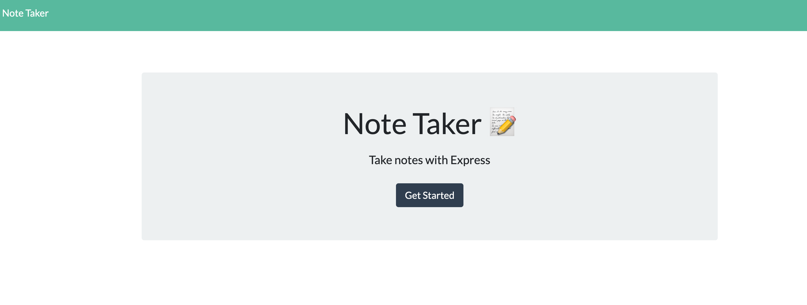
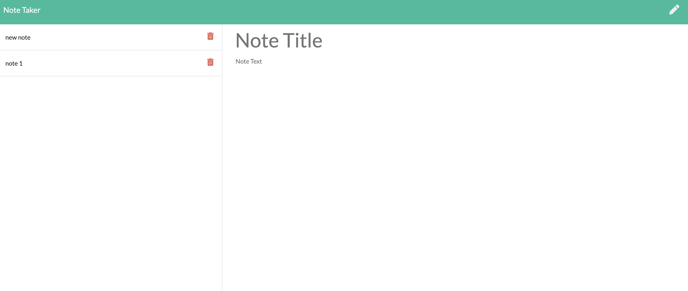
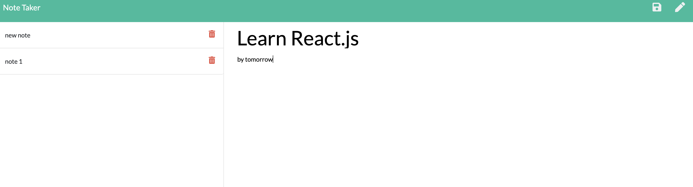
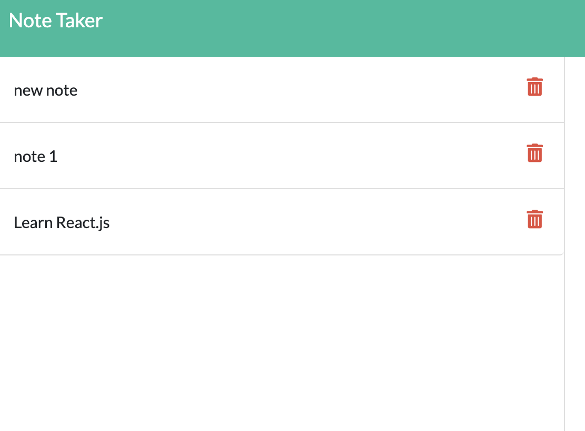

# Notetaker

A minimal node express app that lets you add, save, edit and delete notes. Deployed via Heroku it can be found [here](https://notetakertrilogy.herokuapp.com/).

The app starts with the main/home screen:

Once you click on "Get Started", you are then transfered to the note-taking screen.

You can view all the notes and add new ones by typing in the "Note Title" and "Note text fields.

Once you typed in the content of the new note, you can save it by clicking on the floppy disc symbol in the right top corner. You can also clear out the note-typing field by clicking on the pen icon next to the save button.

Once saved, your note's title will be displayed in the sidebar on your left:

.

You can delete it by clicking on the trash can icon or edit by clicking on the note's title.

The notes will be saved for the next time in the .json file.

Happy note-taking!
